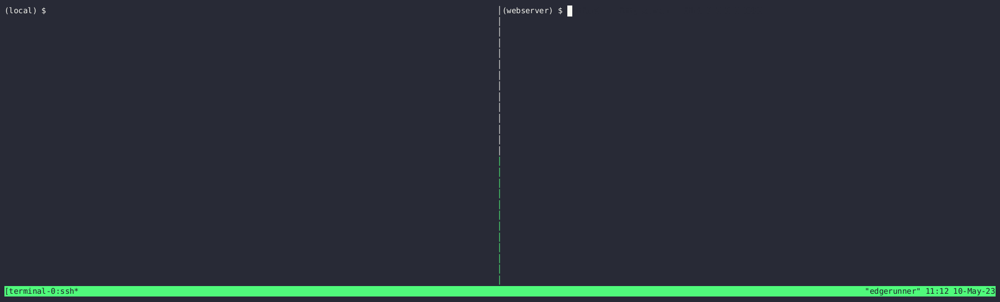

# FireProx

## Description

>Credit to Black Hills Information Security for the original idea ([https://github.com/ustayready/fireprox](https://github.com/ustayready/fireprox))

Being able to hide or continually rotate the source IP address when making web calls can be difficult or expensive. A number of tools have existed for some time but they were either limited with the number of IP addresses, were expensive, or required deployment of lots of VPS's. FireProx leverages the AWS API Gateway to create pass-through proxies that rotate the source IP address with every request! Use FireProx to create a proxy URL that points to a destination server and then make web requests to the proxy URL which returns the destination server response!



### Benefits ##

 * Rotates IP address with every request
 * Configure separate regions
 * All HTTP methods supported
 * All parameters and URI's are passed through
 * Create, delete, list, or update proxies (updated to be implemented...)
 * Spoof X-Forwarded-For source IP header by requesting with an `X-My-X-Forwarded-For header`

## Basic Usage ##


### Requires AWS access key and secret access key or aws cli configured
```
usage: app.py [-h] [--profile-name PROFILE_NAME] [--aws-access-key-id AWS_ACCESS_KEY_ID] [--aws-secret-access-key AWS_SECRET_ACCESS_KEY] [--aws-session-token AWS_SESSION_TOKEN] [--region-name REGION_NAME] [--json]
              {create,delete,update,list} ...

FireProx API Gateway Manager

positional arguments:
  {create,delete,update,list}

optional arguments:
  -h, --help            show this help message and exit
  --progress
                        Show progress updates on console
  --profile PROFILE_NAME
                        AWS Profile Name to store/retrieve credentials
  --aws-access-key-id AWS_ACCESS_KEY_ID
                        AWS Access Key ID
  --aws-secret-access-key AWS_SECRET_ACCESS_KEY
                        AWS Secret Access Key
  --aws-session-token AWS_SESSION_TOKEN
                        AWS Session Token
  --region-name REGION_NAME
                        AWS Region
  --json                Output as JSON
```

## Installation ##
You can install and run with the following command:

```bash
$ git clone xxx fireprox
$ cd fireprox
./fireprox $ python3 -m venv . 
./fireprox $ source ./bin/activate
(fireprox) ./fireprox$ pip install -r requirements.txt
(fireprox) ./fireprox$ ./fireprox --help
```

## Examples
### Create 

>With JSON output

```bash
$ ./fireprox --profile development --progress --json create -u http://foobar:8080/ | jq
Creating: http://foobar:8080/ |███| 1 in 2.8s (0.36/s) 
{
  "api_id": "6lse5z6aa8",
  "name": "fireprox_foobar",
  "created_at": "2023-04-26 16:04:04+10:00",
  "version_dt": "2023-04-26T16:04:02Z",
  "url": "https://6lse5z6aa8.execute-api.ap-southeast-2.amazonaws.com/fireprox/",
  "resource_id": "o1y51v",
  "proxy_url": "http://foobar:8080/",
  "status": "CREATED"
}
```

### List

> with normal output

```bash
$ ./fireprox --profile development --progress list
Gathering List |███| 1 in 1.3s (0.76/s) 
[RUNNING] api_id=6lse5z6aa8, url=https://6lse5z6aa8.execute-api.ap-southeast-2.amazonaws.com/fireprox/, proxy_url=http://foobar:8080/
```

### Delete

>With JSON output

```bash
$ ./fireprox --profile development --progress --json delete --force-all
Deleting All: yml8ru5kti |███| 3 in 3.6s (0.49/s) 
[{"api_id": "y715ra3rx0", "name": "fireprox_foobar", "created_at": "2023-04-26 14:10:36+10:00", "version_dt": "2023-04-26T14:10:34Z", "url": "https://y715ra3rx0.execute-api.ap-southeast-2.amazonaws.com/fireprox/", "resource_id": null, "proxy_url": "http://foobar:8080/", "status": "DELETED"}, {"api_id": "yml8ru5kti", "name": "fireprox_foobar", "created_at": "2023-04-26 14:03:00+10:00", "version_dt": "2023-04-26T14:02:57Z", "url": "https://yml8ru5kti.execute-api.ap-southeast-2.amazonaws.com/fireprox/", "resource_id": null, "proxy_url": "http://foobar:8080/", "status": "DELETED"}]
```

## Contributing

1. Create an issue to discuss your idea
2. Fork FireProx 
3. Create your feature branch (`git checkout -b my-new-feature`)
4. Commit your changes (`git commit -am 'Add some feature'`)
5. Push to the branch (`git push origin my-new-feature`)
6. Create a new Pull Request

**Bug reports, feature requests and patches are welcome.**